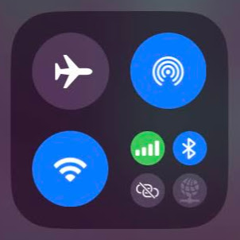
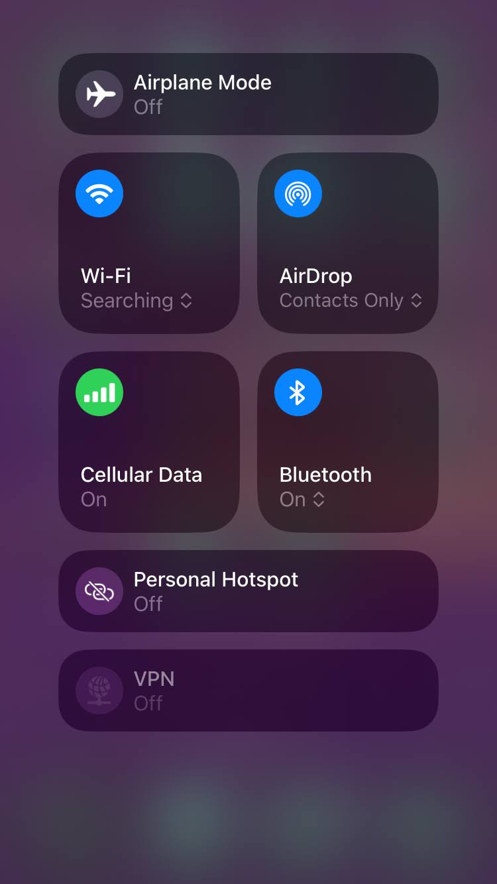

= Connecting to a WAP Through the Connectivity Group

You can connect to a wireless access point (WAP) through the *Connectivity* group.

include::../partials/wap-control-center.adoc[leveloffset=+1]

== Expand the Connectivity Group and Connect to a WAP

. Expand the *Connectivity* group in one of two ways to view its controls:

* If the *Connectivity*  group is present in *Control Center*, touch and hold the group.
* Or tap the *Antenna*  shortcut in *Control Center*.

[start=2]
. If *Wi-Fi* is off, tap it on.
. Touch and hold *Wi-Fi* to display the list of available networks.

image::../images/control-center-networks.jpg[Screenshot of the list of available networks,375,667,pdfwidth=33%]

[start=4]
. Tap the name of the network you want to join.
. If prompted, enter the password in the *Password* field, then tap *Join*.

// CAUTION
include::../partials/caution-password-protection.adoc[]

// SUCCESSFUL CONNECTION
include::../partials/wap-successful-connection.adoc[]

