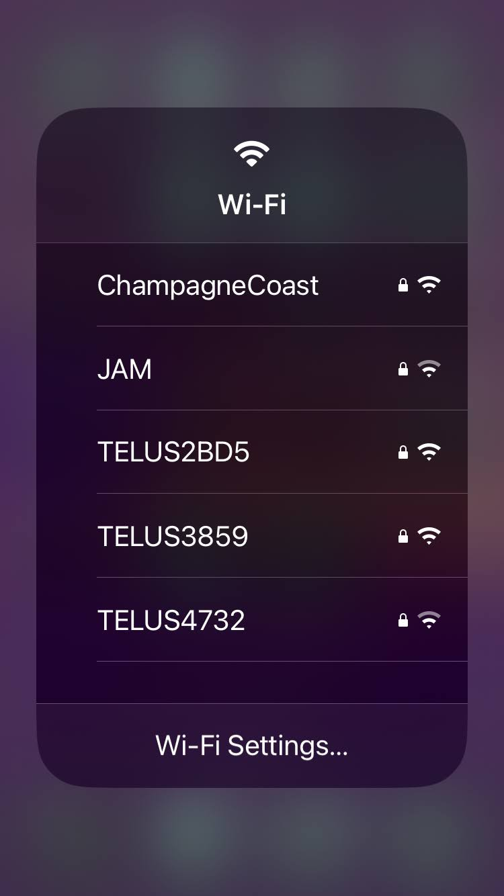

= Connecting to a WAP Through the Wi-Fi Control

You can connect to a wireless access point (WAP) through the *Wi-Fi* control.

include::../partials/wap-control-center.adoc[leveloffset=+1]

== Expand the Wi-Fi Control and Connect to the WAP

. If the *Wi-Fi*  control is present in *Control Center*, complete the following steps:

* If *Wi-Fi* is off, tap it on.
* Touch and hold *Wi-Fi* to display the list of available networks.

[start=2]
. Tap the name of the network you want to join.
. If prompted, enter the password in the *Password* field, then tap *Join*.

// CAUTION
include::../partials/caution-password-protection.adoc[]

// SUCCESSFUL CONNECTION
include::../partials/wap-successful-connection.adoc[]

